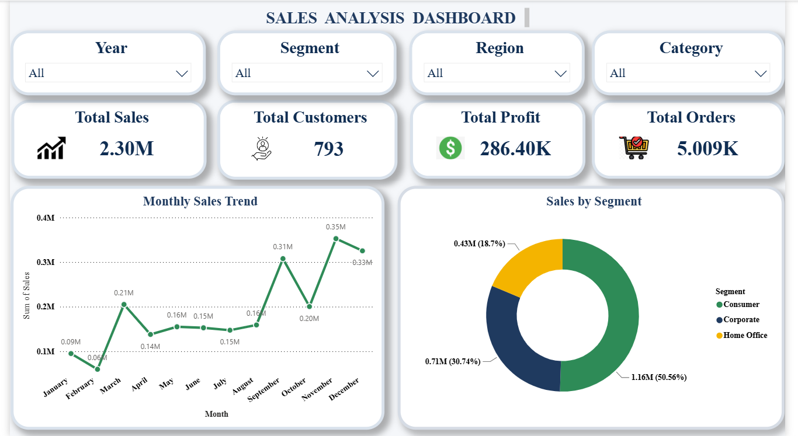
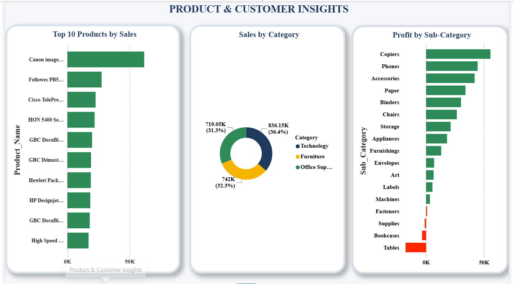
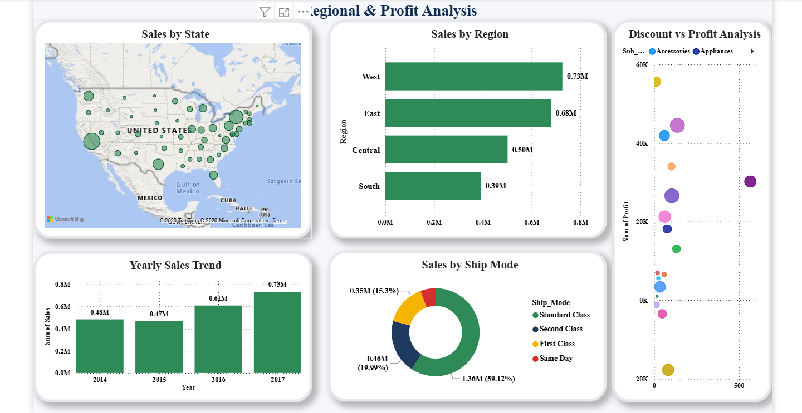

# 📊 Sales Dashboard Analysis

An end-to-end **Data Analytics & Business Intelligence** project that transforms raw sales data into actionable business insights using **Python, MySQL, SQL, and Power BI**.

---

## 📌 Project Overview

The objective of this project is to analyze Superstore sales data and develop an interactive business intelligence dashboard that helps stakeholders monitor sales performance, customer behavior, product trends, and regional performance.

The project follows a complete analytics workflow—from data cleaning and SQL analysis to interactive dashboard development.

---

## 🎯 Objectives

* Clean and preprocess raw sales data.
* Store and manage data using MySQL.
* Perform business analysis using SQL queries.
* Build interactive Power BI dashboards.
* Generate insights to support business decision-making.

---

## 🛠️ Technology Stack

| Technology       | Purpose                       |
| ---------------- | ----------------------------- |
| Python           | Data Cleaning & Preprocessing |
| Pandas & NumPy   | Data Manipulation             |
| MySQL Server     | Database Management           |
| SQL              | Business Analysis             |
| Power BI Desktop | Data Visualization            |

---

## 📂 Project Workflow

```text
Dataset
   │
   ▼
Python Data Cleaning
   │
   ▼
MySQL Database
   │
   ▼
SQL Business Analysis
   │
   ▼
Power BI Dashboard
   │
   ▼
Business Insights
```

---

## 📊 Dashboard Pages

### 📈 Executive Dashboard

Provides an overview of:

* Total Sales
* Total Profit
* Total Customers
* Total Orders
* Monthly Sales Trend
* Sales by Category
* Sales by Segment
* Sales by Region

---

### 📦 Product & Customer Insights

Provides insights into:

* Product Performance
* Customer Analysis
* Category Performance
* Sub-category Analysis
* Product Profitability

---

### 🌍 Regional & Profit Analysis

Includes:

* Sales by State (Map)
* Sales by Region
* Sales by Ship Mode
* Yearly Sales Trend
* Discount vs Profit Analysis

---

## 📸 Dashboard Preview

### 📊 Executive Dashboard

The Executive Dashboard provides an overview of business performance through key performance indicators, sales trends, and customer segmentation.



---

### 📦 Product & Customer Insights

This dashboard focuses on product performance, category-wise sales, and profitability to identify top-performing products and business opportunities.



---

### 🌍 Regional & Profit Analysis

This dashboard analyzes geographical sales distribution, regional performance, shipping modes, yearly sales trends, and the relationship between discounts and profit.


---

## 📈 Key Features

* End-to-End Data Analytics Project
* Data Cleaning using Python
* SQL Business Analysis
* Interactive Power BI Dashboard
* Professional Dashboard Design
* Business-Oriented KPIs
* Interactive Filters and Visualizations

---

## 📁 Repository Contents

* Dataset
* Python Notebook
* SQL Queries
* Power BI Dashboard (.pbix)
* Project Report
* PowerPoint Presentation
* Dashboard Screenshots

---

## 🚀 Business Insights

The dashboard helps businesses to:

* Monitor overall sales performance.
* Identify high-performing regions.
* Analyze customer segments.
* Evaluate product profitability.
* Compare shipping methods.
* Track yearly sales growth.
* Understand the impact of discounts on profit.

---

## 🔮 Future Enhancements

* Real-time database integration.
* Automated dashboard refresh.
* Predictive sales forecasting.
* Customer segmentation using Machine Learning.

---

## ⭐ If you found this project useful, consider giving this repository a Star!
